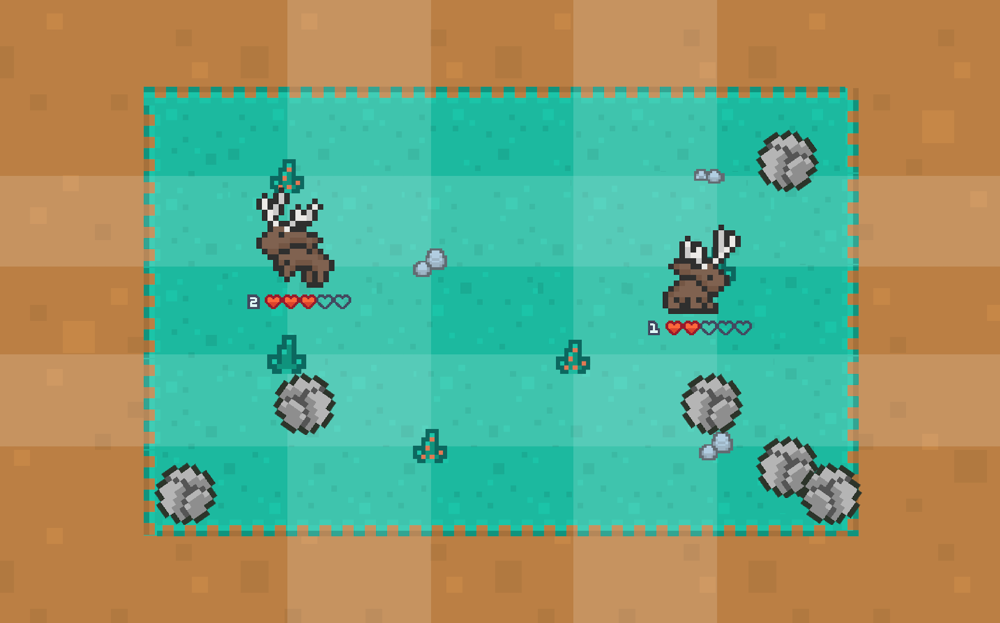

# Excalibur Local Multiplayer Game

## [Click here to play!](https://jackhoefnagel.github.io/ExcaliburArcadeGame/)

Little test project to test the Excalibur framework for local multiplayer code.
Meant for Hogeschool Rotterdam CMGT Arcade cabinet, joystick version is coming up!

Credits:
- Various graphics from [Kenney.nl](https://kenney.nl/)
- Armadillo and Jackalope graphics from [Elthen's Pixel Art Shop](https://elthen.itch.io/)
- Music composed by using samples from [Splice - Chiptune](https://splice.com/sounds/packs/sample-magic/chiptune)
- Sound FX generated with [SFXR.me](https://sfxr.me/)

